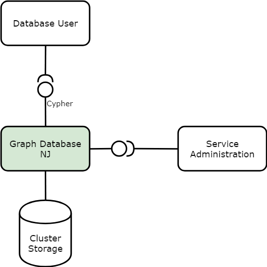

= Graph Database NJ Service Overview
:author: Niamh Shiel
:doc-name: Graph Database NJ Service Overview
:revnumber: 
:doc-no: 1/1551-CAV 101 090/1
:revdate: {sys: date +%Y-%m-%d}
:approved-by-name: 
:approved-by-department: BDGS

== Scope

This document provides an overview of the *Graph Database NJ* Service. It gives a brief description of the main features and interfaces.

== Architecture

The following figure shows the *Graph Database NJ* Service and its architectural context.

.Graph Database NJ Service Architecture

== Service Overview

The Graph Database NJ service is a NoSQL graph database that can provide an ACID-compliant transactional backend for applications. 

Graph Database NJ uses Neo4j as its database back-end. The storage back-end for data is persistent cluster storage, such as Persistent Volume in ECCD.

Graph Database NJ uses Cypher as its query language. Cypher is similar to traditional SQL in that it consists of clauses, keywords and expressions that are familiar, such as WHERE, AND, CREATE, etc. Unlike SQL, Cypher is all about expressing graph patterns.

Some of the key terms used in Graph Database NJ are Nodes, Edges, and Properties.

* *Nodes* are the entities in the graph. Nodes generally represent objects. They can contain several attributes known as properties. Nodes can be tagged with labels to represent the different roles within the domain.
+

* *Edges* represent the relationships between nodes. An edge always has a direction, type, start node, and end node. Edges can have properties. These properties are usually quantitative, such as costs, distances, time intervals, etc. Two nodes can share any number or type of edges without sacrificing performance.
+

* *Properties* are the name-value pairs that are used to add qualities to nodes and edges. The value part of the property can hold different data types such as number, string, and Boolean.

More information on Cypher <<ref_1,[1]>> is available on the Neo4j website.

The Graph Database NJ service users can remotely connect via the client interface. This can be done using any of the available drivers <<ref_2,[2]>>.

The application operations engineer can remotely connect to and manage the Graph Database NJ service via the provided admin tool.

== Deployment

Graph Database NJ is packaged as a container running inside a pod. It supports deployment in ECCD using Helm.

A deployment guide can be found in Graph Database NJ Service Deployment Guide <<ref_3,[3]>>. It contains steps to get started using the Graph Database NJ Service in the supported environments.
In case of problems with the service see the Graph Database NJ Service Troubleshooting Guide <<ref_4,[4]>> for tips.

[bibliography]
References
----------

[bibliography]
- [[ref_1]] Neo4j Cypher Query Language https://neo4j.com/developer/cypher/
- [[ref_2]] Neo4j client drivers https://neo4j.com/developer/language-guides/
- [[ref_3]] Graph Database NJ Service Deployment Guide doc-no:[1/1531-CAV 101 090/1]
- [[ref_4]] Graph Database NJ Service Troubleshooting Guide doc-no:[1/15451-CAV 101 090/1]